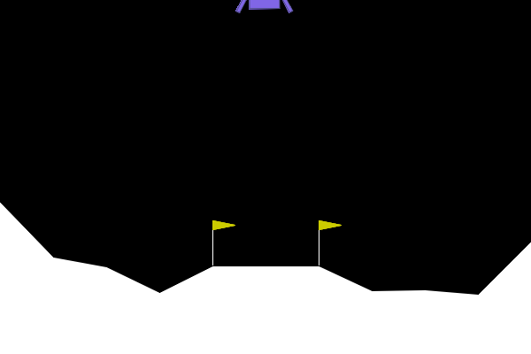
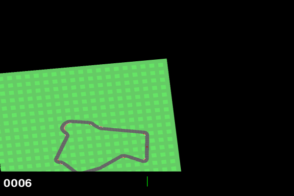

# Teaching AI to Land and Drive: A Journey into Deep Reinforcement Learning

A link to the post in Medium:
https://medium.com/@ignaciogutierrezserrera/teaching-ai-to-land-and-drive-a-journey-into-deep-reinforcement-learning-08509e37eefd?postPublishedType=initial

## Introduction
I want to explain this project in the simplest possible way, for people with no background in computer engineering or artificial intelligence. There will be no formulas or mathematical explanations here — those are easy to find elsewhere. Instead, I’ll focus on the concepts, because I believe that’s the best way to capture attention: show something cool, explain it simply, and if the reader is intrigued, they can dive deeper later.

## What is the Goal?
We tackled two classic challenges in the world of AI:
1.  **Lunar Lander:** Landing a spacecraft safely on the Moon's surface.
2.  **Car Racing:** Driving a race car around a track as fast as possible without crashing.

It looks like a video game (in fact, it is!), but behind the scenes, there are algorithms allowing the machine to learn how to do this entirely on its own.

## Deep Reinforcement Learning (DRL) Explained
The models are trained using **Deep Reinforcement Learning (DRL)**.
-   **Reinforcement Learning (RL):** Think of teaching a dog new tricks. Every time the AI takes an action, it gets a **reward** (treat) if it’s good or a **penalty** (scolding) if it’s bad. Over time, it learns which choices lead to the most treats.
-   **Deep Learning (DL):** This is where **neural networks** come in, giving the AI the "brainpower" to handle complex problems like processing images or controlling unstable physics.

DRL combines both: the trial‑and‑error learning of RL with the power of neural networks, giving the possibility to also review past events (an event is an episode, which is each time the agent faces the task at hand) to learn from them or discard them based on its total reward.

### Neural Networks: The "Team of Students" Analogy
Neural networks can sound intimidating, but conceptually they’re easier to grasp with an analogy:
-   Imagine a **team of students** trying to solve a complex exam together.
-   Each student (neuron) solves a small part of the problem and passes their answer to the next student.
-   At first, they just guess randomly. But after every practice exam (training episode), their work is graded.
-   They adjust their strategy based on the mistakes they made. After thousands of practice exams, they become experts.
The catch: If you have too many students for a simple problem, they might overthink it or get lazy, this is called overfitting and it is one of the main problems needed to be taken into account when doing anything with AI, from the most basic to the most astonishing algorithms, where they settle for a “good enough” solution without exploring better ones. Think of a smart but lazy student: they study just enough to pass, but don’t aim for the best grade.
If you have too little students, they can't solve it. Thus, finding the right balance is key.

The Graphics Card and Lazy Student Analogies
A problem for a neural network is like a video game for a graphics card:
- The more complex the game (more details, more fps, higher resolution), the more powerful the card must be.
- Similarly, the more complex the problem (more input variables, more possible actions), the deeper and larger the neural network must be, since this allows for more calculations over the variables and grasping their relationship better.
A practical rule of thumb:
- Add more depth if there are many variables.
- Add more neurons if the variables are very complex.

### How Computers "See": Convolutional Neural Networks (CNNs)
While the "Team of Students" works well for numbers, images are harder. For our Car Racing agent, we used **Convolutional Neural Networks (CNNs)**.

Think of how you recognize a dog:
1.  **First Glance (Early Layers):** Your brain (as well as AI, since its goal is to mimic our intelligence) first notices simple things like vertical lines, horizontal edges, or curves.
2.  **Closer Look (Middle Layers):** These lines combine to form recognizable shapes—maybe a circle for an eye, a triangle for an ear, or the texture of fur.
3.  **The Big Picture (Deep Layers):** Finally, the brain pieces these shapes together. "Floppy ears + Snout + Tail = **Dog**."

The network learns this hierarchy on its own, starting from simple patterns and building up to complex understanding. This is exactly what our AI uses to "see" the curves of the race track!

---

## Part 1: The Lunar Lander 🚀

The goal here is simple: guide a lander from the top of the screen to a landing pad at the bottom using three engines (main, left, right).

  

### What We Learned
We experimented with different "brain sizes" (neural network architectures) to see what worked best.

1.  **Bigger Isn't Always Better:** We found that a medium-sized network (128 neurons per layer) performed **better** than much larger ones. The massive networks often refused to learn or "overthought" the problem, crashing endlessly while the simpler ones mastered the landing quickly.
2.  **The "Wind" Challenge:** We added wind to the simulation to make it harder. Suddenly, our perfect pilots started crashing. It turns out, adapting to a changing environment is much harder than mastering a static one. Only our most robust models could handle the gusts, and even they struggled!
3.  **Reward Shaping is Key:** The AI is very literal. If you just say "don't crash," it might hover at the top of the screen forever to avoid hitting the ground. We had to carefully craft the rewards: "Go down, but slowly," "Keep your legs level," "Save fuel."

**Best Model:** *128_best* (A simple, efficient network that lands perfectly almost every time).

---

## Part 2: Car Racing 🏎️

This challenge is harder because the AI has to "see" the track. It receives images (pixels) just like a human driver would, rather than just numbers for coordinates.

  

### What We Learned
1.  **Seeing the World:** We used **Convolutional Neural Networks (CNNs)**, which are specialized for image processing. The AI learned to recognize the borders of the track and the curves ahead.
2.  **Standard vs. Randomized:** We tried "Domain Randomization" — changing the colors of the track and background to force the AI to focus on the road shape rather than cheating by memorizing colors. Obviously, **standard training worked better**. The AI learned faster and drove smoother on the standard track than the one forced to adapt to psychedelic colors.
3.  **The "Fine-Tuning" Trap:** We tried taking pro racer AIs (that is, models trained under normal track conditions) and teaching them to handle the randomized tracks. They actually performed **worse** than training new drivers from scratch! Sometimes, unlearning bad habits (like memorising track colors) on easy conditions is harder than learning new harder ones.

**Best Model:** *Car Racing 2368* (A consistent, safe driver that rarely crashes).

---

## Video Showcase 🎥

Here are some highlights of our agents in action.

### 1. The Perfect Landing (Lunar Lander)
This is our **128_best** model demonstrating a textbook landing. Notice how it stabilizes itself and cuts the engine just before touchdown.

<video width="600" controls>
  <source src="Discrete_environment/videos/128_best.mp4" type="video/mp4">
  Your browser does not support the video tag.
</video>

### 2. A Smooth Lap (Car Racing)
Watch the **Car Racing 2368** model navigate sharp turns. It learned to brake *before* the curve and accelerate *out* of it — a pro racing technique learned entirely through trial and error!

<video width="600" controls>
  <source src="Continuous_environment/videos/car_racing_2368.mp4" type="video/mp4">
  Your browser does not support the video tag.
</video>

### 3. Struggling with Wind
Here is a model trying to fight against strong wind. You can see it fighting to stay centered, a much harder task than a calm day.

<video width="600" controls>
  <source src="Discrete_environment/videos/wind_3.mp4" type="video/mp4">
  Your browser does not support the video tag.
</video>

---

## Conclusion

The Lunar Lander and Car Racing projects are fascinating examples of how artificial intelligence can learn complex tasks autonomously.
-   **Lesson 1:** You don't always need a supercomputer. A well-designed, small neural network can often beat a massive one.
-   **Lesson 2:** Defining *what* you want (the reward) is often harder than building the brain itself.
-   **Lesson 3:** Generalization (handling wind or different tracks) is the next frontier. It's easy to memorize a solution; it's hard to understand the underlying physics.

By combining reinforcement learning with neural networks, the AI not only learns to land a spacecraft or drive a car but also demonstrates how algorithms can mimic—and sometimes surpass—human learning processes.
